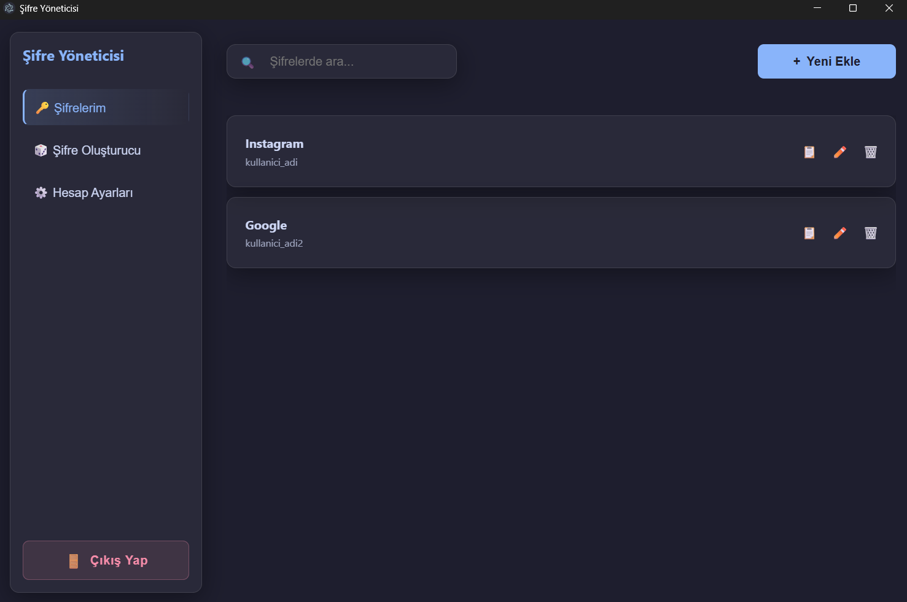
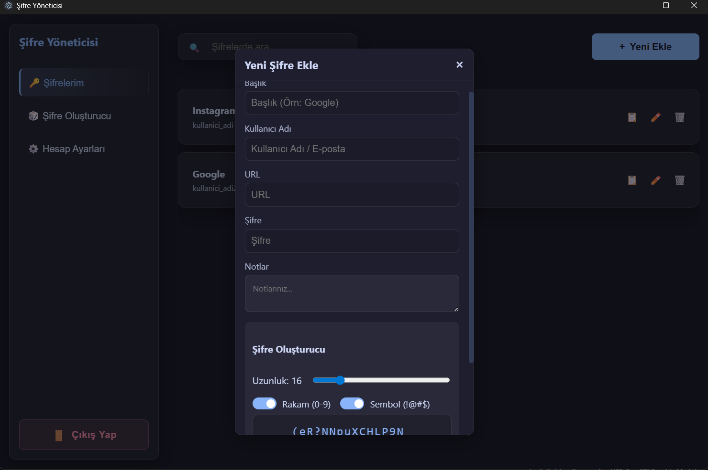
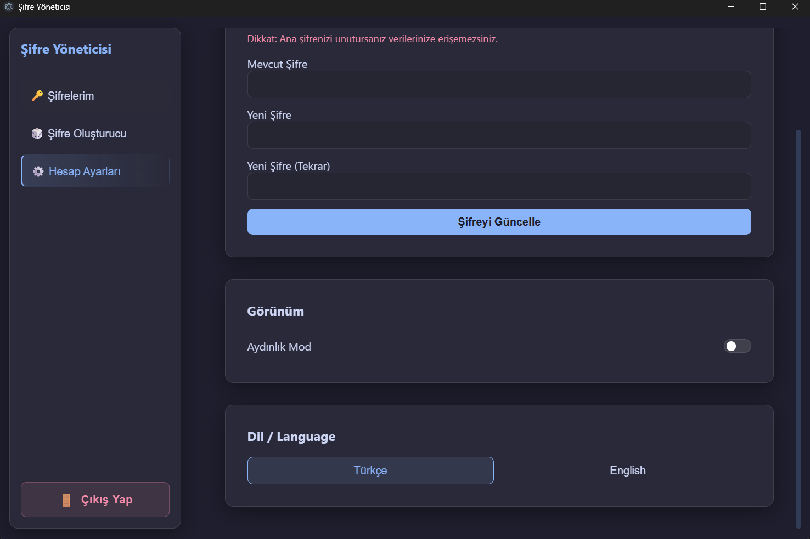

# Güvenli ve Şifreli Yerel Şifre Yöneticisi

Bu proje, verilerinizin güvenliğini en üst düzeyde tutan, **uçtan uca şifreleme** teknolojisiyle geliştirilmiş modern bir masaüstü uygulamasıdır. Verileriniz asla bir sunucuya gönderilmez; tamamen cihazınızda şifrelenmiş bir şekilde saklanır.

## 🛡️ Güvenlik ve Özellikler

*   � **Uçtan Uca Şifreleme:** Tüm verileriniz, veritabanına yazılmadan önce güçlü şifreleme algoritmalarıyla (AES-256) korunur. Ana şifreniz olmadan verilere erişim imkansızdır.
*   🔒 **%100 Yerel ve Çevrimdışı:** Verileriniz buluta taşınmaz, sadece sizin bilgisayarınızda barınır. "Sıfır Bilgi" (Zero-Knowledge) prensibiyle çalışır.
*   🔑 **Ana Şifre Koruması:** Uygulamaya giriş ve şifre çözme işlemleri sadece sizin belirlediğiniz ana şifre ile yapılır.
*   🎲 **Güçlü Şifre Oluşturucu:** Tahmin edilmesi imkansız, karmaşık şifreler oluşturarak hesap güvenliğinizi artırır.
*   🌍 **Çoklu Dil Desteği:** Türkçe ve İngilizce dil seçenekleri ile global kullanım.
*   🎨 **Modern Arayüz:** Göz yormayan karanlık/aydınlık mod seçenekleri ve modern tasarım.
*   📝 **Güvenli Notlar:** Hesaplarınız için özel notları da şifrelenmiş olarak saklayabilirsiniz.

## 📷 Ekran Görüntüleri

| Giriş Ekranı | Uygulama Arayüzü | Hesap Ayarları |
| :---: | :---: | :---: |
|  |  |  |

## Kurulum ve Çalıştırma

Projeyi bilgisayarınıza indirdikten sonra çalıştırmak için aşağıdaki adımları izleyin:

1.  Gerekli paketleri yükleyin:
    ```bash
    npm install
    ```

2.  Uygulamayı geliştirici modunda başlatın:
    ```bash
    npm run dev
    ```

3.  Uygulamayı derlemek (build) için:
    ```bash
    npm run build
    ```

## Kullanılan Teknolojiler

*   [Electron](https://www.electronjs.org/)
*   [React](https://reactjs.org/)
*   [Vite](https://vitejs.dev/)
*   [Node.js](https://nodejs.org/)

## Lisans

Bu proje kişisel kullanım için geliştirilmiştir.
