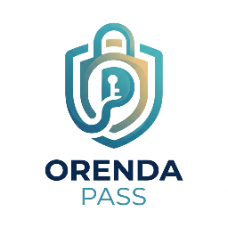
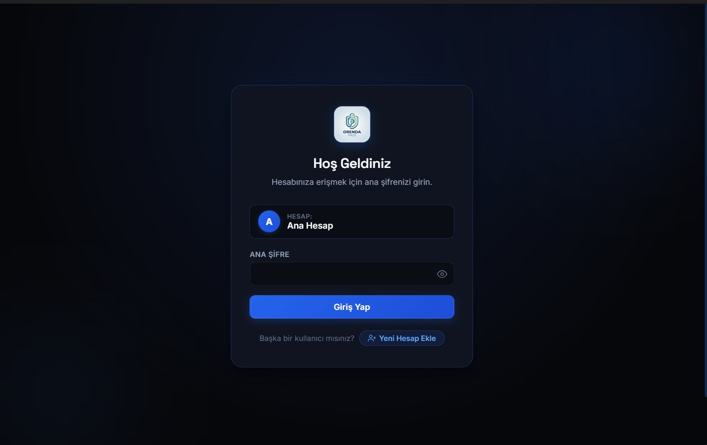
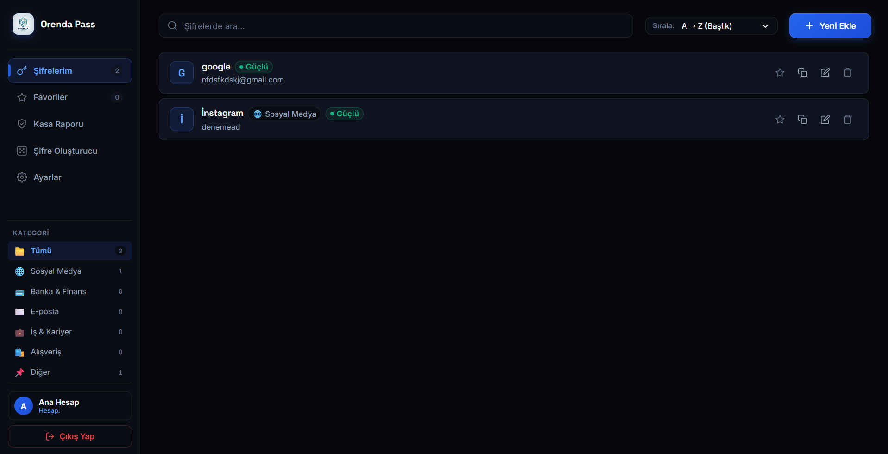
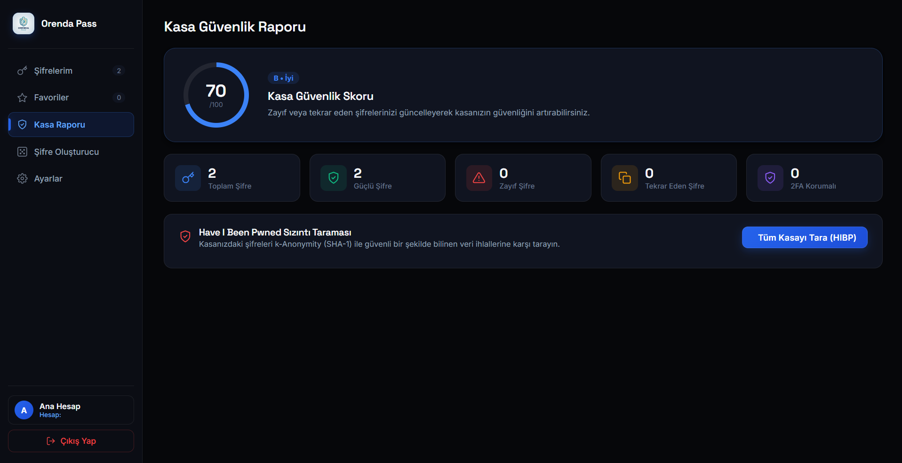
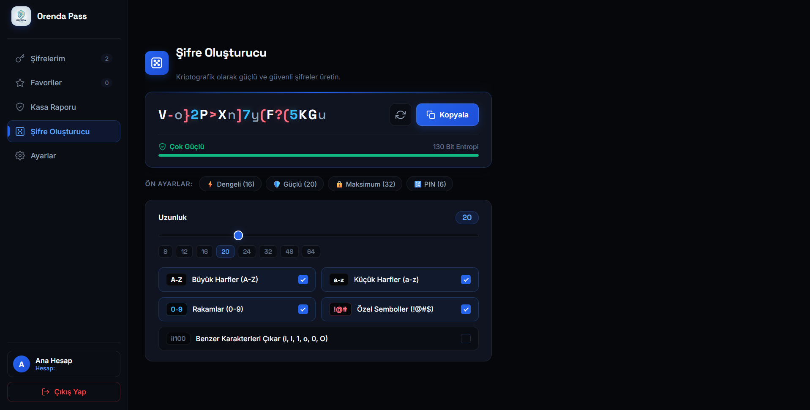
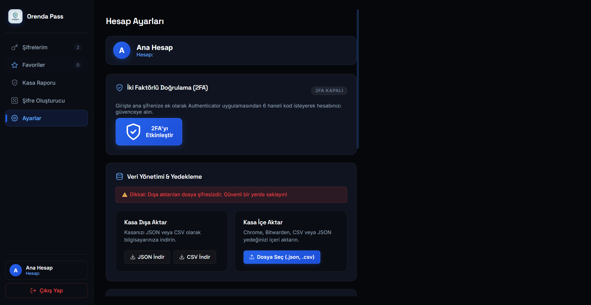
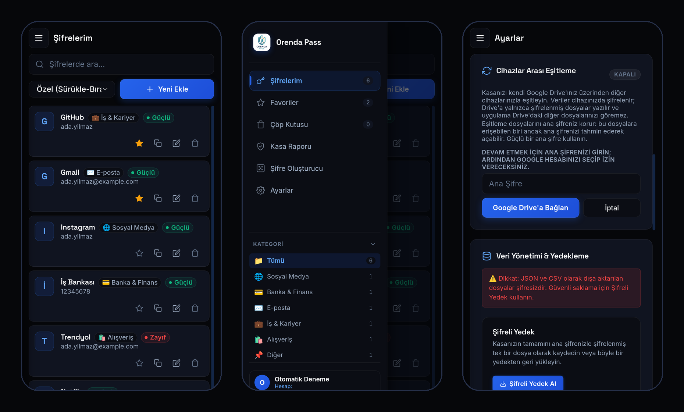

<div align="center">

  <a href="README.md">English</a> | <strong>Türkçe</strong>

  

  # Orenda Pass
  ### Güvenli, Şifreli ve Sıfır Bilgili (Zero-Knowledge) Yerel Şifre Yöneticisi

  <p align="center">
    Verilerinizin kontrolünü tamamen elinize alın. Bize ait bir sunucu olmadan, <strong>AES-256</strong> şifreleme ile yerel ve bağımsız kullanıcı kasaları; Windows ve Android için.
  </p>

  <p align="center">
    
    
    
    
    
    
  </p>

  <p align="center">
    <a href="#-temel-özellikler">Özellikler</a> •
    <a href="#-ekran-görüntüleri">Ekran Görüntüleri</a> •
    <a href="#-güvenlik-mimarisi">Güvenlik</a> •
    <a href="#-kurulum-dosyası">İndir</a> •
    <a href="#-kurulum-ve-çalıştırma">Kaynaktan Derleme</a> •
    <a href="README.md">English Documentation</a>
  </p>

</div>

---

## 🌟 Genel Bakış

**Orenda Pass**, hassas hesap bilgilerinizi, kimlik doğrulama anahtarlarınızı (TOTP/2FA) ve gizli notlarınızı en yüksek güvenlik standartlarında saklamanız için geliştirilmiş, Windows ve Android için açık kaynaklı bir uygulamadır.

Geleneksel bulut tabanlı şifre yöneticilerinin aksine, **Orenda Pass** "Sıfır Bilgi" (*Zero-Knowledge*) prensibiyle çalışır ve kendine ait bir sunucusu yoktur. Ana şifreniz cihazınızdan hiç çıkmaz; şifreleme ve çözme işlemleri tamamen cihazınızda gerçekleşir. Kasanız da cihazınızda kalır; cihazlar arası eşitlemeyi açarsanız yalnızca şifrelenmiş dosyalar, seçtiğiniz bir klasöre ya da kendi Google Drive'ınıza yazılır.

---

## 📥 Kurulum Dosyası

**[⬇️ En güncel sürümü indirin](https://github.com/yigitfevzitugrul/Password-Manager/releases/latest)**

### Windows

1. Son sürümün **Assets** bölümünden `Orenda.Pass-Setup-x.y.z.exe` dosyasını indirin.
2. Kurulum dosyasını çalıştırın. Dosya dijital olarak imzalı olmadığı için Windows SmartScreen uyarı gösterebilir: **Ek bilgi → Yine de çalıştır** seçeneğiyle devam edin.
3. **Orenda Pass**'i açın, bir hesap oluşturun ve ana şifrenizi belirleyin. **Ana şifre sıfırlanamaz** — unutursanız kasanız açılamaz.

Windows 10/11 (64-bit) gerektirir.

### Android

1. Telefonunuzda son sürümün **Assets** bölümünden `Orenda.Pass-x.y.z.apk` dosyasını indirin.
2. Dosyayı açın. Android, dosyayı açtığınız uygulamaya (tarayıcı ya da dosya yöneticisi) yükleme izni vermenizi ister; bu kurulum için izin verin.
3. **Orenda Pass**'i açın. Bilgisayarınızdaki hesabı kullanmak için önce orada eşitlemeyi açın (Ayarlar → Cihazlar Arası Eşitleme → Google Drive), sonra telefonda **Hesabımı Bu Cihaza Ekle**'yi seçin.

Android 7.0 veya üzerini gerektirir. Uygulama Google Play'de değildir; güncellemeler aynı yolla, mevcut uygulamanın üzerine kurulur.

İndirdiğiniz dosyayı doğrulayabilmeniz için her sürümün notlarında dosyaların SHA-256 özetleri yer alır.

---

## 🛡️ Temel Özellikler

- 🔒 **Uçtan Uca Yerel Şifreleme (AES-256):** Tüm kasa verileriniz endüstri standardı AES-256 algoritmaları ve scrypt anahtar türetme ile şifrelenir.
- 👥 **Çoklu Kullanıcı Desteği:** Aynı bilgisayarı kullanan farklı bireyler için birbirinden tamamen izole edilmiş, bağımsız şifrelenmiş kullanıcı hesapları.
- 🔐 **İki Faktörlü Doğrulama (2FA / TOTP Entegrasyonu):**
  - **Uygulama İçi 2FA:** Kasaya girişte Google Authenticator, Microsoft Authenticator ve uyumlu TOTP uygulamaları desteği.
  - **Şifreler İçin TOTP:** Saklanan her hesap için 2FA kodu üretme ve geri sayım sayacı.
- 🔍 **Have I Been Pwned (HIBP) Sızıntı Analizi:** Şifrelerinizin bilinen küresel veri ihlallerinde yer alıp almadığını *k-Anonymity* güvenli sorgulama modeliyle denetleme.
- 📊 **Kasa Güvenlik Raporu:** Dinamik güvenlik skoru, zayıf ve tekrar eden şifre tespitleri, güvenlik önerileri.
- 🎲 **Gelişmiş Kriptografik Şifre Oluşturucu:** Renk kodlu karakter ayrımı (sayılar, semboller, harfler), gerçek zamanlı entropi hesabı ve tek tıkla ön ayarlar (*Dengeli, Güçlü, Maksimum, PIN*).
- 📱 **Windows ve Android:** Bilgisayarınızda ve telefonunuzda aynı kasa, aynı özellikler ve aynı dosya formatı.
- 🔄 **Sunucusuz Cihazlar Arası Eşitleme:** Kasanızı kendi Google Drive'ınız üzerinden, masaüstünde isterseniz seçtiğiniz herhangi bir klasör (örneğin başka bir bulut sürücüsü) üzerinden diğer cihazlarınızla eşitleyin. Oraya yalnızca cihazınızda şifrelenmiş dosyalar yazılır; bir cihazda yaptığınız değişiklik saniyeler içinde diğerlerinde görünür. Aynı kayıt iki cihazda değiştirilirse sonraki değişiklik kazanır ve diğer şifre geçmişte saklanır.
- 📦 **Esnek İçe / Dışa Aktarma (Yedekleme):** Chrome, Bitwarden, CSV ve JSON formatlarındaki yedekleri kolayca içeri aktarma veya dışa aktarma.
- ⏱️ **Kaba Kuvvet (Brute-Force) Koruması:** Arka arkaya yapılan hatalı giriş denemelerinde kademeli kilitlenme ve güvenlik zamanlayıcısı.
- 🌗 **Karanlık & Aydınlık Mod:** Göz yormayan Obsidian Black ve modern Clean Slate temaları.
- 🌍 **Çoklu Dil Desteği:** Tek tıkla Türkçe ve İngilizce dil değişimi.

---

## 📷 Ekran Görüntüleri

### 1. Giriş ve Hesap Seçim Ekranı
Çoklu kullanıcı mimarisi, zero-knowledge şifre koruması ve bağımsız hesap yönetimi.
<p align="center">
  
</p>

---

### 2. Ana Kasa & Şifre Yönetimi Paneli
Kategorize edilmiş kayıtlar, anlık filtreleme, favoriler, şifre gücü göstergeleri ve hızlı kopyalama eylemleri.
<p align="center">
  
</p>

---

### 3. Kasa Güvenlik Raporu & Sızıntı Denetimi
Kapsamlı kasa güvenlik skoru, veri sızıntısı tarayıcısı (HIBP) ve tekrar eden şifre uyarıları.
<p align="center">
  
</p>

---

### 4. Kriptografik Şifre Oluşturucu
Karakter türlerine göre renklendirilmiş önizleme, bit entropisi göstergesi ve hazır ön ayarlar.
<p align="center">
  
</p>

---

### 5. Hesap Ayarları, 2FA & Veri Yönetimi
İki faktörlü kimlik doğrulama ayarları, modern JSON & CSV içe/dışa aktarma paneli ve tema tercihleri.
<p align="center">
  
</p>

---

### 6. Android Uygulaması & Google Drive ile Eşitleme
Aynı kasa telefonunuzda: kayıtlar, gezinme menüsü ve kendi Google Drive'ınız üzerinden eşitlemeyi açma.
<p align="center">
  
</p>

---

## 🔒 Güvenlik Mimarisi

```
+-------------------------------------------------------------------+
|                        Kullanıcı Ana Şifresi                       |
+-------------------------------------------------------------------+
                                  |
                                  v
+-------------------------------------------------------------------+
|          scrypt Anahtar Türetme (bellek-yoğun, N = 2^17)           |
+-------------------------------------------------------------------+
                                  |
                                  v
+-------------------------------------------------------------------+
|                    AES-256-GCM Şifreleme                           |
+-------------------------------------------------------------------+
                                  |
                                  v
+-------------------------------------------------------------------+
|       Yerel Dosya Sistemi (vault_[userId].enc & users.json)        |
+-------------------------------------------------------------------+
```

- **Sıfır Bilgi Prensibi (Zero-Knowledge):** Ana şifreniz hiçbir zaman diske açık metin olarak kaydedilmez ve geliştiriciler dahil kimse tarafından sıfırlanamaz.
- **k-Anonymity Sızıntı Denetimi:** Have I Been Pwned API sorgularında şifrenin tamamı değil, SHA-1 özetinin yalnızca ilk 5 karakteri gönderilir; şifreniz asla açığa çıkmaz.
- **Oturum Koruması:** Kasa açıkken bellekte yalnızca türetilmiş anahtar tutulur. Kasa ayarlanabilir bir hareketsizlik süresinden sonra (varsayılan 5 dakika), ekran kilitlenince ve uyku modunda otomatik kilitlenir; kopyalanan şifreler ayarlanabilir bir süre sonra (varsayılan 30 saniye) panodan silinir.
- **Yerel Depolama İzolasyonu:** Her kullanıcının kasa dosyası işletim sisteminin güvenli uygulama verisi dizininde (`%APPDATA%/sifreyonetici`) ayrı dosyalarda tutulur. Android'de kasa uygulamanın özel depolama alanında durur, Android'in kendi yedeklemelerine dahil edilmez ve uygulama ekran görüntüsü ile ekran kaydını engeller.
- **Depolama Yerine Güvenmeden Eşitleme:** Eşitleme dosyaları cihazda rastgele bir anahtarla şifrelenir; bu anahtar da ana şifrenizle (ve kullanıyorsanız anahtar dosyanızla) şifrelenmiş olarak yanlarında durur. Google Drive'da uygulama yalnızca kendi gizli uygulama klasörüne erişim ister (`drive.appdata`): diğer dosyalarınızı göremez; Google da yalnızca şifreli dosyaları, boyutlarını ve ne zaman değiştiklerini görür. Eşitleme dosyalarını okuyabilen biri yine de ana şifrenizi tahmin etmek zorundadır; bu yüzden güçlü bir ana şifre kullanın.

---

## 🚀 Kurulum ve Çalıştırma

> Yalnızca uygulamayı kullanmak mı istiyorsunuz? [İndir](#-kurulum-dosyası) bölümüne bakın. Aşağıdaki adımlar kaynak koddan derlemek içindir.

### Gereksinimler
- [Node.js](https://nodejs.org/) (v18 veya üzeri önerilir)
- npm veya yarn

### Adımlar

1. **Depoyu klonlayın:**
   ```bash
   git clone https://github.com/yigitfevzitugrul/Password-Manager.git
   cd Password-Manager
   ```

2. **Bağımlılıkları yükleyin:**
   ```bash
   npm install
   ```

3. **Geliştirici modunda başlatın:**
   ```bash
   npm run dev
   ```
   *(Vite dev sunucusu ve Electron masaüstü penceresi eşzamanlı olarak açılacaktır.)*

4. **Üretim sürümünü derleyin (Windows Installer):**
   ```bash
   npm run build
   ```
   *(`dist-electron/` dizini altında Windows `.exe` kurulum dosyası üretilir.)*

5. **Testleri çalıştırın:**
   ```bash
   npm test
   npm run test:e2e
   ```
   *(`npm test` kasa formatını ve mantığını her platformun şifreleme uygulamasıyla sınar. `npm run test:e2e` gerçek uygulamayı geçici bir veri klasörüyle başlatıp uçtan uca dener; çalışırken sistem panosunu kullanır.)*

### Android Uygulamasını Derleme

Yukarıdakilere ek olarak JDK 21 ve Android SDK (platform 36, build-tools 36) gerekir; `android/local.properties` dosyası SDK'yı göstermelidir (`sdk.dir=...`).

```bash
npm run android:sync
cd android
./gradlew assembleRelease
```

*(`npm run android:sync` web uygulamasını mobil için derleyip Android projesine kopyalar. APK `android/app/build/outputs/apk/release/` altında oluşur. `android/keystore.properties` yoksa derleme Android'in hata ayıklama anahtarıyla imzalanır; bkz. `android/app/build.gradle`.)*

### Kendi Derlemenizde Google Drive Eşitlemesi

Resmi sürümler projenin Google istemcisini içerir. Kendi derlemeniz için, Drive API'si etkin ve `drive.appdata` kapsamı eklenmiş bir Google Cloud projesinden kendi (ücretsiz) istemcinizi almanız gerekir:

- **Masaüstü:** "Desktop app" türünde bir OAuth istemcisi oluşturun ve Google'ın indirmeye sunduğu dosyayı `electron/google-oauth.json` olarak kaydedin. Bu dosya yoksa masaüstü uygulaması yalnızca klasörle eşitlemeyi sunar.
- **Android:** `com.yigit.orendapass` paket adı ve derlemenizi imzaladığınız anahtarın SHA-1 parmak izi için "Android" türünde bir OAuth istemcisi oluşturun.

### Kod Yapısı

- `shared/` — kasa formatı, şifreleme, eşitleme ve tüm kasa mantığı. Platformdan bağımsızdır; masaüstü ve mobil uygulamalar tam olarak aynı dosyaları okuyup yazar.
- `electron/` — masaüstü kabuğu: pencere, güvenlik ayarları ve ortak kodun üzerinde çalıştığı Node tabanlı şifreleme, depolama, pencereler ve Google girişi.
- `src/` — React kullanıcı arayüzü. `src/host/`, Electron'un olmadığı yerde (mobil uygulama) ortak kodu saf JavaScript şifrelemeyle sayfanın içinde çalıştırır.
- `android/` — web uygulamasını saran Android projesi (Capacitor) ve yerel Google giriş eklentisi.
- `tests/` — birim testleri (`tests/unit`) ve uçtan uca testler (`tests/e2e`).

---

## 🛠️ Kullanılan Teknolojiler

| Alan | Teknoloji | Açıklama |
| :--- | :--- | :--- |
| **Masaüstü Altyapısı** | [Electron 44](https://www.electronjs.org/) | Çapraz platform masaüstü çekirdeği |
| **Mobil Altyapısı** | [Capacitor 8](https://capacitorjs.com/) | Aynı web arayüzünü saran Android uygulaması |
| **Ön Yüz Kütüphanesi** | [React 19](https://react.dev/) | Hızlı ve reaktif bileşen mimarisi |
| **Derleme & Paketleme** | [Vite 7](https://vitejs.dev/) | Ultra hızlı HMR ve üretim derleyicisi |
| **Dağıtım / Paketleyici** | [electron-builder](https://www.electron.build/) | Windows NSIS kurulum paketi oluşturucu |
| **Güvenlik & Kripto** | Node.js `crypto` (masaüstü), [@noble](https://paulmillr.com/noble/) (mobil) | AES-256, scrypt, SHA-256 / SHA-1 |
| **Eşitleme** | Google Drive API veya yerel klasör | Yalnızca şifreli dosyalar; bize ait sunucu yok |
| **Tipografi & Stil** | Space Grotesk & Inter | Modern ve rafine kullanıcı deneyimi |

---

## 📄 Lisans

Bu proje MIT Lisansı ile yayımlanmıştır. Ayrıntılar için [`LICENSE`](LICENSE) dosyasına bakabilirsiniz.
